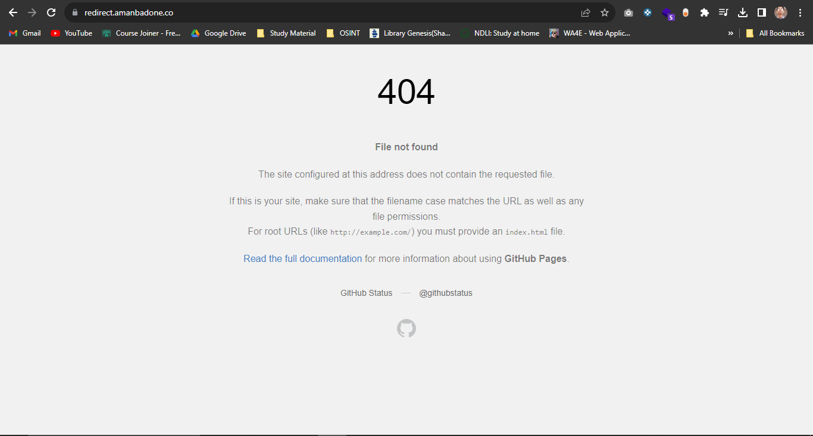
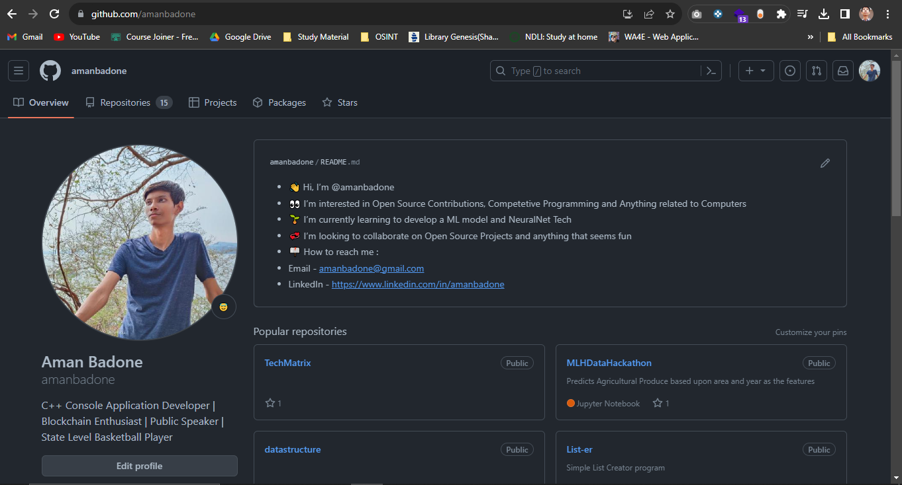

# Redirect


[](LICENSE)

> A simple project for redirecting to selected URLs using meta tag refreshing.

## Table of Contents

- [About the Project](#about-the-project)
- [Getting Started](#getting-started)
  - [Prerequisites](#prerequisites)
  - [Installation](#installation)
- [Usage](#usage)
- [Contributing](#contributing)
- [License](#license)
- [Acknowledgements](#acknowledgements)

## About the Project

In this project, I've developed a redirector hosted on one of my subdomains. It operates by appending '/PATH' to the URL, where 'PATH' represents the destination to which you wish to be redirected.
<!-- Add a screenshot or gif here -->

## Getting Started

To configure this on your local machine, you'll only require Node.js, a YAML parser package, and a few other dependencies outlined in the prerequisites.


### Prerequisites

Services that need to be installed before running the project. For example:

- Node.js
- npm
- YAML Parser

### Installation


```bash
# Clone the repository
git clone https://github.com/amanbadone/redirect.git

# Navigate to the project directory
cd redirect

# Install dependencies
npm install
npm install yaml

## Usage

We have the ability to create our own tailored URL redirector. In fact, we can explore the potential to expand this project into a URL shortener as well.

```bash
node index.js
npx http-server out/
```
## Demonstration

Without Any Parameter / Redirect PATH


When Redirect PATH = github



## Contributing

While there aren't specific guidelines, please keep in mind:
- Each code or code block should be thoroughly explained in comments, detailing its functionality.

## License

This project is licensed under the MIT License - see the [LICENSE](LICENSE) file for details.

## Acknowledgements

This project got inspired from one of the sessions conducted by MLH during the Hacktoberfest.

---
